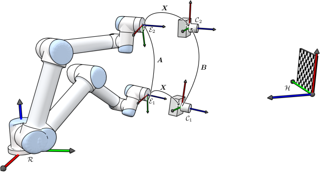
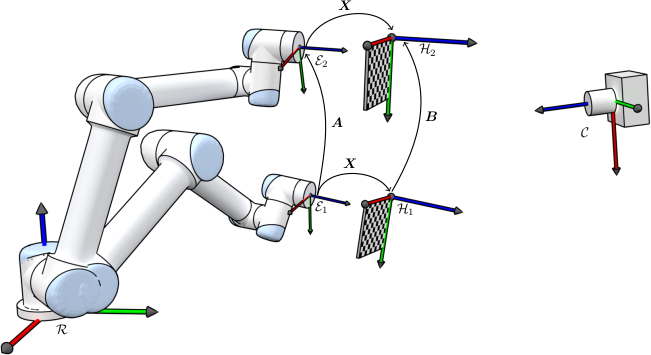

# Camera Calibration

The camera calibration process contains two types of calibration: eye-in-hand and eye-to-hand. 

## Eye-in-Hand Calibration

The hand-in-eye calibration is used to find the transformation matrix between the camera frame and the end-effector frame of the robot. In this case, we assume that the camera is rigidly attached to the end-effector of the robot and the April tag is fixed relative to the base of the robot.

<figure style="text-align: center;">
  
  <figcaption>Eye-in-Hand Calibration Illustration (Credit to <a href="https://www.torsteinmyhre.name/snippets/robcam_calibration.html">Torstein A. Myhre</a>)</figcaption>
</figure>

The problem can be formulated as $\mathbf{AX} = \mathbf{XB}$, where $\mathbf{A}$ can be computed using forward kinematics, $\mathbf{B}$ can be computed using the measurements of the transformation matrix between the camera frame and the April tag frame. The goal is to find $\mathbf{X}$, which represents the transformation matrix between the end-effector frame and the camera frame. 

## Eye-to-Hand Calibration

The hand-to-eye calibration is used to find the transformation matrix between the camera frame and the base frame of the robot. In this case, we assume that the camera is fixed relative to the base of the robot.

<figure style="text-align: center;">
  
  <figcaption>Eye-to-Hand Calibration Illustration (Credit to <a href="https://www.torsteinmyhre.name/snippets/robcam_calibration.html">Torstein A. Myhre</a>)</figcaption>
</figure>

Similar to the eye-in-hand case, here the value of $\mathbf{A}$ and $\mathbf{B}$ can be obtained using forward kinematics and camera measurements, respectively. The goal is to find $\mathbf{X}$, which represents the transformation matrix between the end-effector (hand) frame and the checkerboard frame. Then, the transformation matrix between the camera frame and the base frame can be computed as

$$^\mathrm{camera}\mathbf{T}_\mathrm{base} = {}^\mathrm{camera}\mathbf{T}_\mathrm{board}{}^\mathrm{board}\mathbf{T}_\mathrm{hand}{}^\mathrm{hand}\mathbf{T}_\mathrm{base}$$
