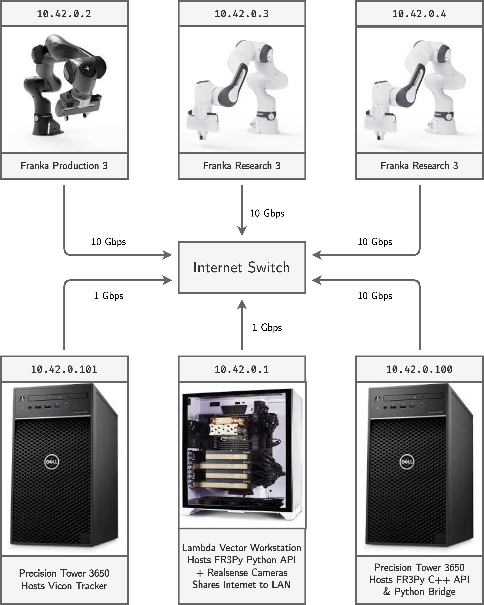

# Network Setting

The robots have static IP addresses. The IP addresses are assigned as follows:

|        Robot         | IP Address |
| -------------------- | ---------- |
| Franka Production 3  | 10.42.0.2  |
| Franka Research 3 #1 | 10.42.0.3  |
| Franka Research 3 #2 | 10.42.0.4  |